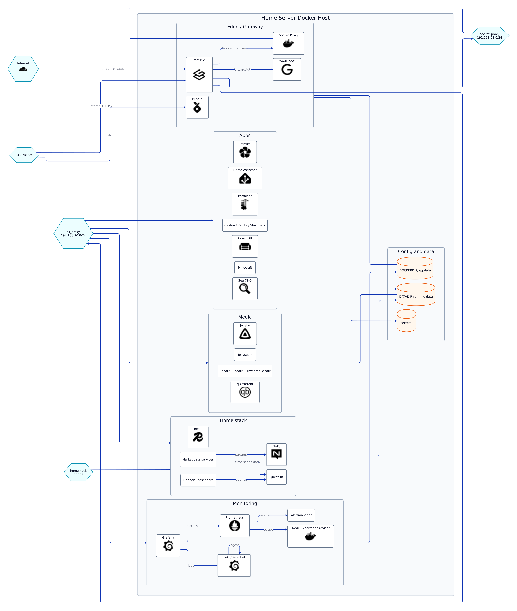

# Home Server Docker 服務

本專案使用 **Docker Compose** 與 **Docker** 管理 Home Server 上的各項服務。

整體架構與命名方式參考 [SimpleHomelab/Docker-Traefik](https://github.com/SimpleHomelab/Docker-Traefik)：該專案在根目錄下為每台 Home Server 各準備一份 Compose 檔。由於目前僅有一台主機，這裡改為依**服務類型**劃分，每一份 Compose 對應一類職責。



---

## Compose 檔案與職責劃分

| Compose 檔案 | 職責 | 說明 |
|-------------|------|------|
| `docker-compose-infrastructure.yml` | 網關（Gateway）+ 監控 | Traefik + Socket Proxy + OAuth + Prometheus + Grafana |
| `docker-compose-app.yml` | 應用（App） | Immich、Home Assistant、Minecraft 等（見 `compose/apps/`） |
| `docker-compose-media.yml` | 媒體（Media） | Jellyfin、*arr、qBittorrent 等 |
| `docker-compose-homestack.yml` | 自訂（Home stack） | NATS / JetStream 與其它自訂程式（見 `compose/homestack/`） |
| `docker-compose-ai.yml` | AI stack | AI 服務與 sandbox data plane，以及 Hermes / proxy control plane（獨立於 App） |

AI stack 使用獨立的 Compose 邊界：`t3_proxy` 供 Traefik 對外路由，`ai_services` 承載 AI 服務與 sandbox 資料面，`ai_control` 承載 Hermes 與 proxy 控制面。該入口檔由 AI stack unit 提供；在入口檔尚未加入前，不要以缺少 `docker-compose-ai.yml` 判定既有 stack 失敗。

若再新增類型，可補上對應 Compose 主檔並更新此表。

---

## Infrastructure：網關（Gateway）+ 監控

Infrastructure 對應的 Compose 為 **`docker-compose-infrastructure.yml`**，負責**網關**與**監控**，包含：

1. **Traefik** — 反向代理、路由、TLS（Let's Encrypt DNS-Cloudflare）、服務發現（經 Socket Proxy）  
2. **Socket Proxy** — Docker API 安全代理，Traefik 透過 `tcp://socket-proxy:2375` 取得容器資訊，不直接掛載 Docker socket
3. **traefik-forward-auth** — OAuth 2.0 SSO，供 Traefik 的 forwardAuth 使用
4. **Prometheus** — 指標收集與儲存（profile: `monitor`）
5. **Grafana** — 監控儀表板（profile: `monitor`）

網關動態設定與憑證：`appdata/traefik/rules/`、`appdata/traefik/acme/`；日誌：`logs/traefik/`。敏感資訊放 `secrets/`，勿提交版控。

### 啟動前準備

1. **環境變數**：複製 `.env.example` 為 `.env`，填寫 `DOCKERDIR`、`DOMAINNAME_1`、`TRAEFIK_PORT`、`LOCAL_IPS`（與選填 `CLOUDFLARE_IPS`）。  
2. **Secrets**：在 `secrets/` 放置 `basic_auth_credentials`（htpasswd 格式）、`cf_dns_api_token`（Cloudflare API token）。詳見 `secrets/README.md`。  
3. **ACME**：在 `appdata/traefik/acme/` 建立 `acme.json`（`echo '{}' > acme.json` 後 `chmod 600 acme.json`）。詳見 `appdata/traefik/acme/README.md`。

### 啟動與常用指令

```bash
# 啟動網關服務（不含監控）
docker compose -f docker-compose-infrastructure.yml up -d

# 啟動網關 + 監控服務
docker compose -f docker-compose-infrastructure.yml --profile monitor up -d

# 檢視日誌
docker compose -f docker-compose-infrastructure.yml logs -f

# 停止
docker compose -f docker-compose-infrastructure.yml down
```

Dashboard：`https://traefik.<DOMAINNAME_1>`（OAuth 保護、僅內網）。對外埠：80/81（HTTP）、443/444（HTTPS）、`TRAEFIK_PORT`（Traefik API；若啟用 insecure，務必以防火牆限制僅內網）。

> **安全邊界**：stock Socket Proxy 是 Docker API route gate，只限制哪些 API route 可被呼叫，不是完整的 sandbox boundary。若 Hermes 共用 host daemon（例如透過 Docker socket 或等效控制通道），Hermes 仍具有高權限；必須把它視為 control plane，不可宣稱為隔離的低權限 sandbox。

監控服務：
- **Prometheus**：`https://prometheus.<DOMAINNAME_1>`（僅內網，OAuth 保護）
- **Grafana**：`https://grafana.<DOMAINNAME_1>`（OAuth 保護）

---

## AI stack：服務與控制平面

AI stack 對應獨立的 **`docker-compose-ai.yml`**（由 AI stack unit 提供），不要再把 Hermes 或 SearXNG 當作 App 服務清單的一部分。其職責分為：

- **`t3_proxy`（Traefik）** — 對內路由、TLS、OAuth 與服務發現；只負責網關，不等於 sandbox。
- **`ai_services`（AI service / sandbox data plane）** — AI runtime、工具服務與 sandbox 需要的資料面；應以最小網路與檔案權限執行。
- **`ai_control`（Hermes / proxy control plane）** — Hermes agent、模型 proxy 與控制流；控制面可接觸的 daemon 或 API 必須明確列出並視為高權限邊界。

常用指令（`docker-compose-ai.yml` 加入後使用）：

```bash
# 驗證 AI stack 設定
docker compose -f docker-compose-ai.yml config --quiet

# 啟動 AI stack
docker compose -f docker-compose-ai.yml up -d

# 檢視 AI stack 日誌
docker compose -f docker-compose-ai.yml logs -f

# 停止 AI stack
docker compose -f docker-compose-ai.yml down
```

新增 AI 服務前，請完成 `AGENTS.md` 的安全與文件 checklist，並在服務說明中標示它屬於 data plane 或 control plane、需要的網路、資料掛載、認證方式及實際權限。

---

## 設定文件（docs）

專案設定與操作說明放在 **`docs/`**，可依 **Compose 職責** 分層查閱：

- **Infrastructure** — 網關（Traefik、Socket Proxy、OAuth、Pi-hole）的架構、環境變數、服務定義、Traefik 規則、操作與疑難排解
- **App** — 應用類服務（以 `docker-compose-app.yml` 管理，例如 Immich、Home Assistant）
- **Media** — 媒體服務（`docker-compose-media.yml`）
- **Home stack** — 自訂服務與 NATS（`docker-compose-homestack.yml`，詳見 `docs/homestack/`）
- **AI stack** — AI services/sandbox data plane 與 Hermes/proxy control plane（`docker-compose-ai.yml`；入口檔加入後補上對應 `docs/ai/` 文件）

以 [MkDocs](https://www.mkdocs.org/) + Material 主題建置成網頁後，左側導航即為上述層級。建置方式：

```bash
pip install -r requirements-docs.txt
mkdocs serve    # 本地預覽 http://127.0.0.1:8000
mkdocs build    # 輸出至 site/
```

設定檔：`mkdocs.yml`（導航）、`docs/`（Markdown 來源）。建置輸出 `site/` 已列入 `.gitignore`。

---

## 目錄結構（概要）

- `docs/` — 設定文件（Infrastructure / App / Media / Home stack；見上方「設定文件」）
- `compose/infrastructure/` — 網關與監控服務定義（socket-proxy.yml、traefik.yml、prometheus.yml、grafana.yml…）  
- `compose/apps/` — App 類服務定義（例如 `immich.yml`）
- `compose/media/` — Media 類服務定義
- `compose/homestack/` — Home stack（例如 `nats.yml`）
- `compose/ai/` — AI stack 的 data plane 與 control plane 服務定義（入口檔加入後使用）
- `appdata/traefik/` — Traefik 動態規則、ACME 憑證
- `appdata/prometheus/` — Prometheus 設定檔
- `appdata/nats/` — NATS 主設定檔（`nats-server.conf`）
- `secrets/` — 密碼、API Token（見 `secrets/README.md`）  

---

## 參考資源

- [SimpleHomelab/Docker-Traefik](https://github.com/SimpleHomelab/Docker-Traefik) — 多主機 Docker + Traefik 範例與學習資源  
