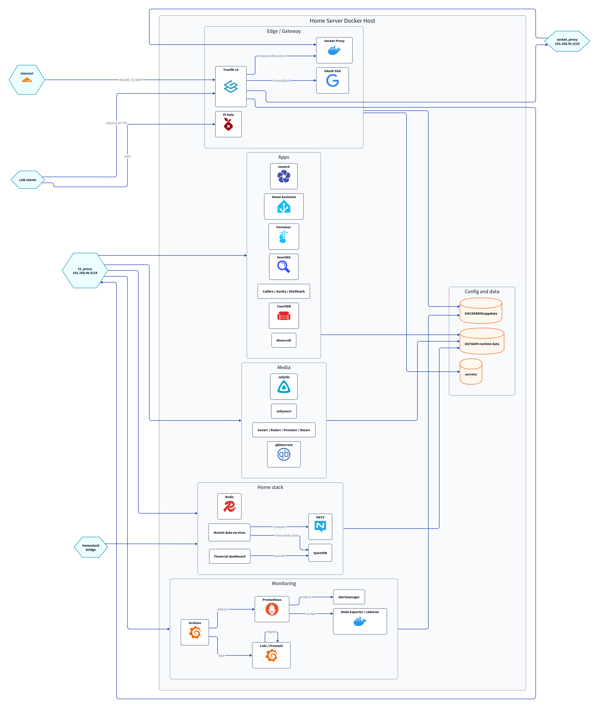

# 網路圖



這張圖由 `docs/diagrams/home-server-overview.d2` 產生，`home-server-overview.svg` 與 `home-server-overview.png` 是建置產物。需要更新拓撲時，請修改 `.d2` 來源檔，不要手動編輯產出的圖片。

GitHub Actions 會在 `docs/diagrams/*.d2` 或渲染 workflow 變更後自動重新產生 SVG/PNG，並把產物 commit 回 `main`。

本機預覽可執行：

```bash
docker run --rm --user "$(id -u):$(id -g)" -v "$PWD/docs/diagrams:/work" terrastruct/d2:v0.7.1 --layout elk --pad 40 /work/home-server-overview.d2 /work/home-server-overview.svg
rsvg-convert -z 2 docs/diagrams/home-server-overview.svg -o docs/diagrams/home-server-overview.png
```
